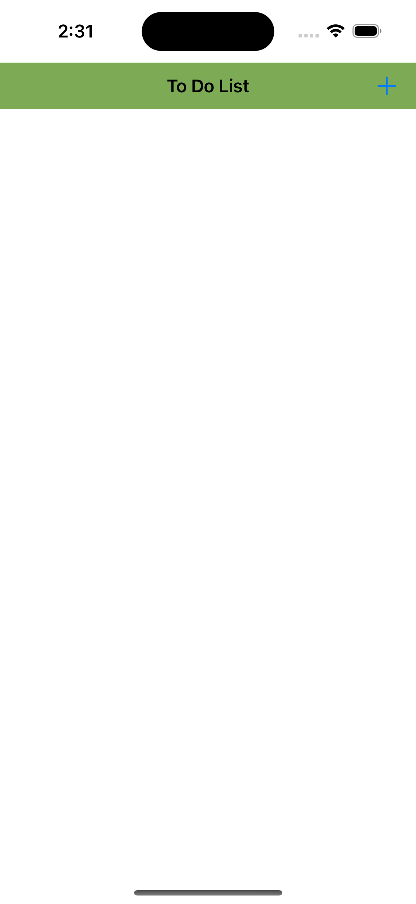
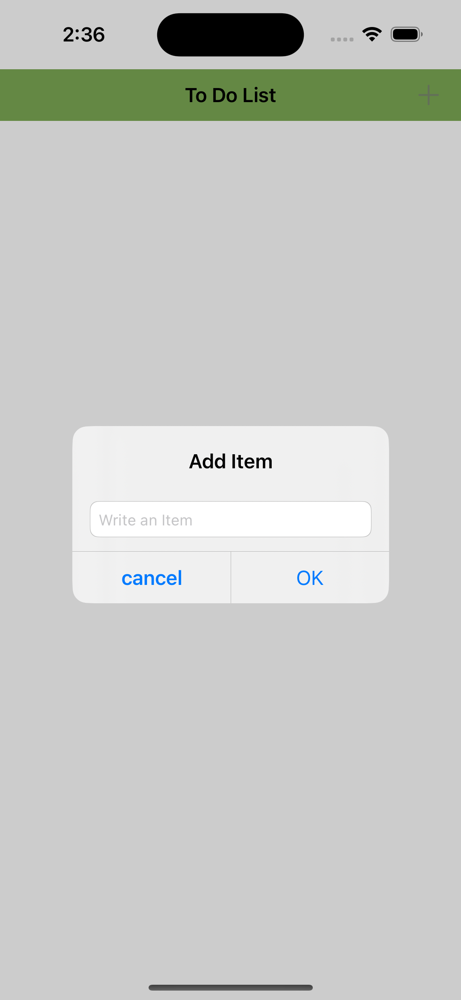
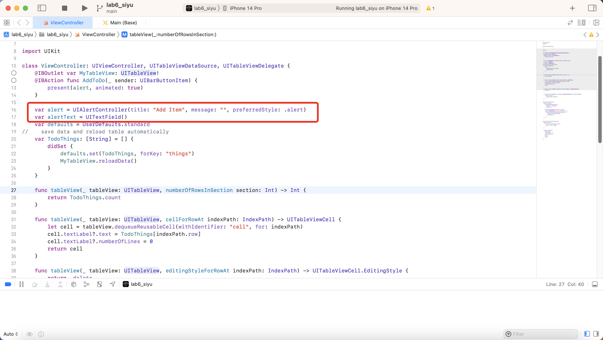
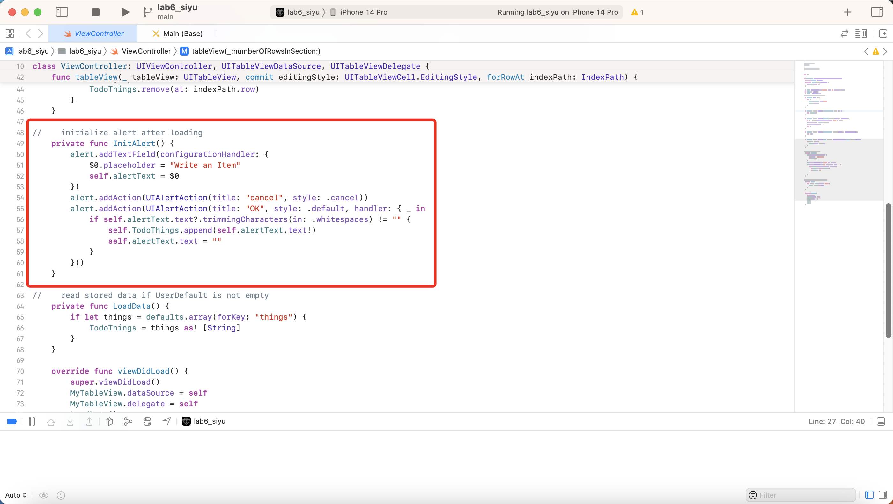
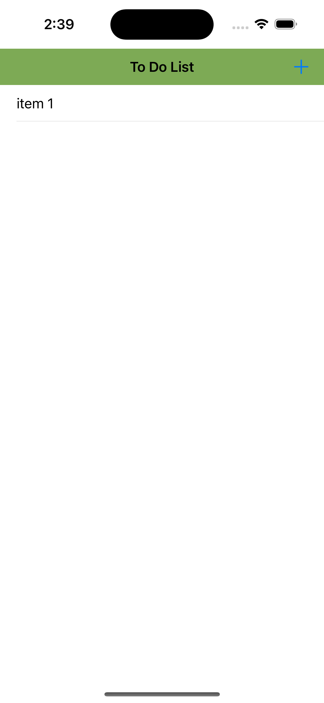
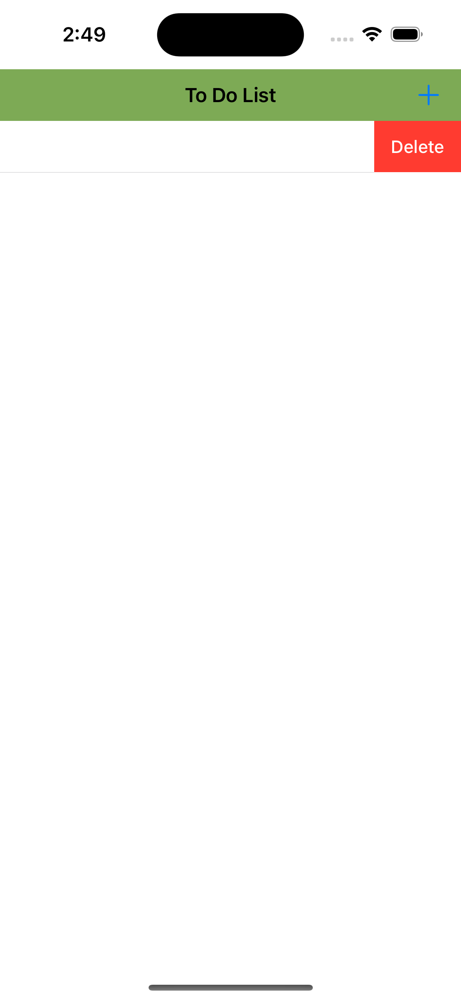
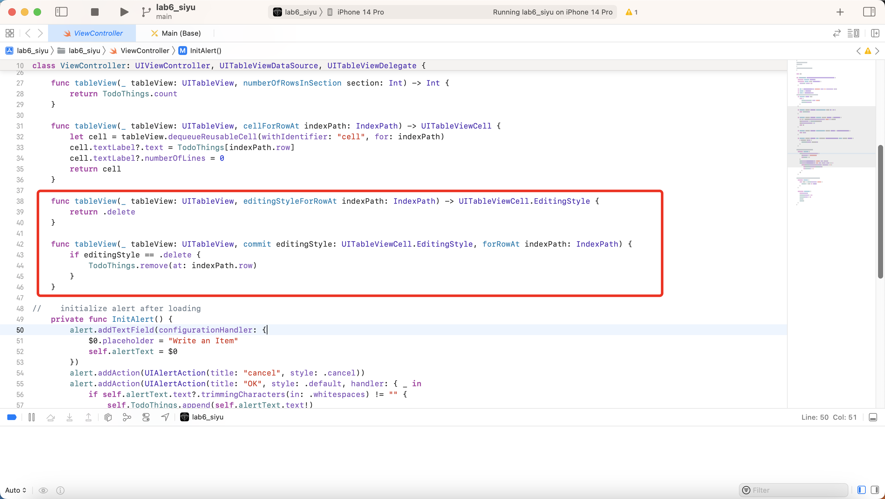
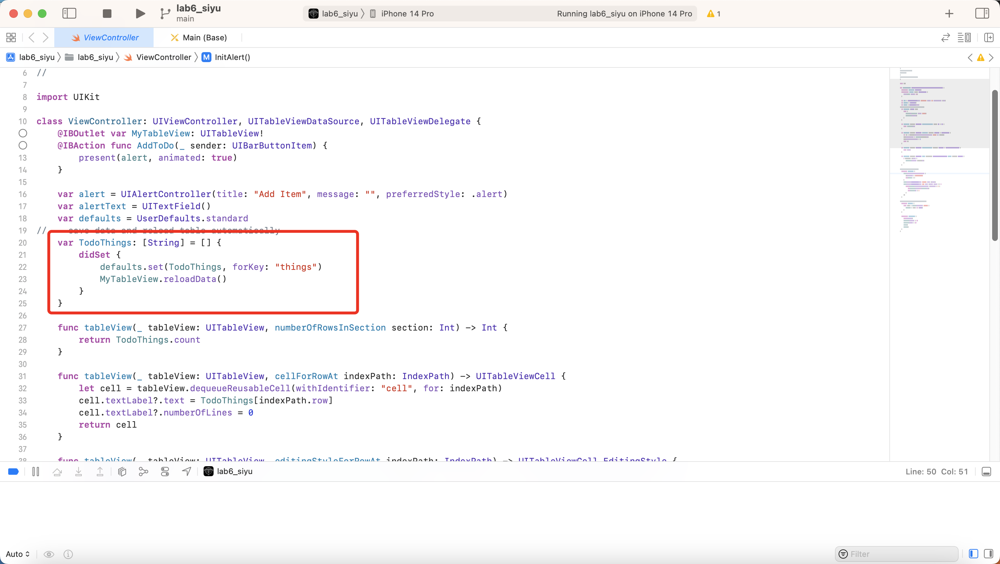

# PROG8470-IOS-Lab6-Table-View-Todo-List

Lab6 SPA project of PROG8470 IOS development of Conestoga College. The data source of this app is UserDefaults, the stored data will be displayed in tableView.

## Initial State

The app displays a navigation bar and tableView area, there's noting of initial state.

## Add new thing to do

click the plus button on the right side of the navigation bar, then the instance of  UIAlertController with textfield will display to add a new item in the tableView.

Alert code: 

After adding a new Item

## Remove Item

TableViewController provide hooks to handle delete event (drag the list item)

code:

## Permanent Storing Data

To store data permanently, if the data source has been modified, then the tableView should reload and Userdefaults should also be changed.

didSet for the string list is the good place to modify the load data and reload tableView.

